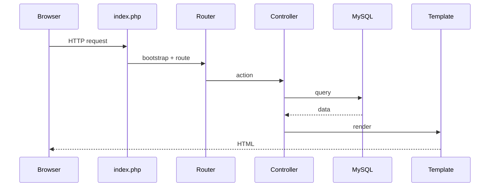
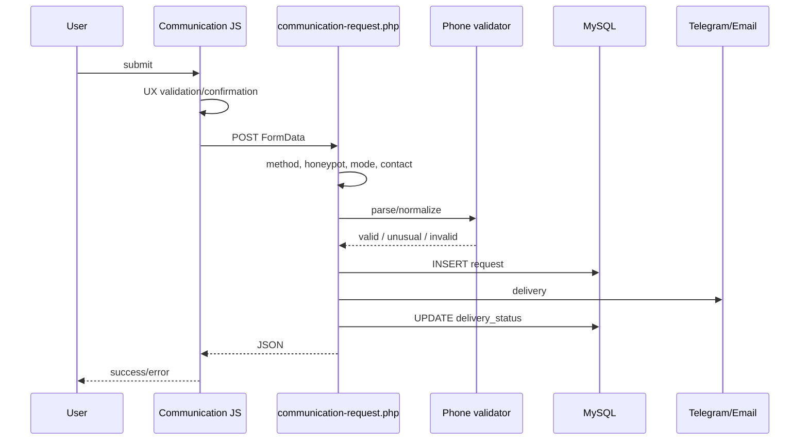

# Runtime і потоки запитів v0.1

**ID:** `FP-WEB-ARCH-003`

## Page request

## Communication request

## Канонічні правила

- endpoint приймає POST;
- honeypot не повинен давати false positive через autofill;
- потрібен хоча б один contact channel;
- phone validation остаточно виконує server;
- заявка зберігається незалежно від зовнішнього delivery result;
- `delivery_status` фіксує результат;
- SMTP/Telegram secrets надходять із runtime environment;
- JSON не розкриває secrets і внутрішні exception details.

## Image upload flow

1. admin або maintenance tool приймає source;
2. перевіряються MIME, розмір і decode;
3. створюється optimized derivative;
4. card context використовує cover-crop;
5. gallery зберігає повніший кадр;
6. БД отримує relative path;
7. frontend показує потрібну версію.

## Failure boundaries

| Збій | Поведінка |
|---|---|
| PHP parse error | Зупинити flow до виправлення |
| DB failure | Контрольована помилка без credentials |
| Telegram/SMTP failure | Заявка збережена, status фіксує failure |
| Invalid phone | Block або soft confirm залежно від класу |
| JS failure | Server усе одно захищає endpoint |
| Image decode failure | Не замінювати чинний файл |
| Smoke regression | Не commit до пояснення |
