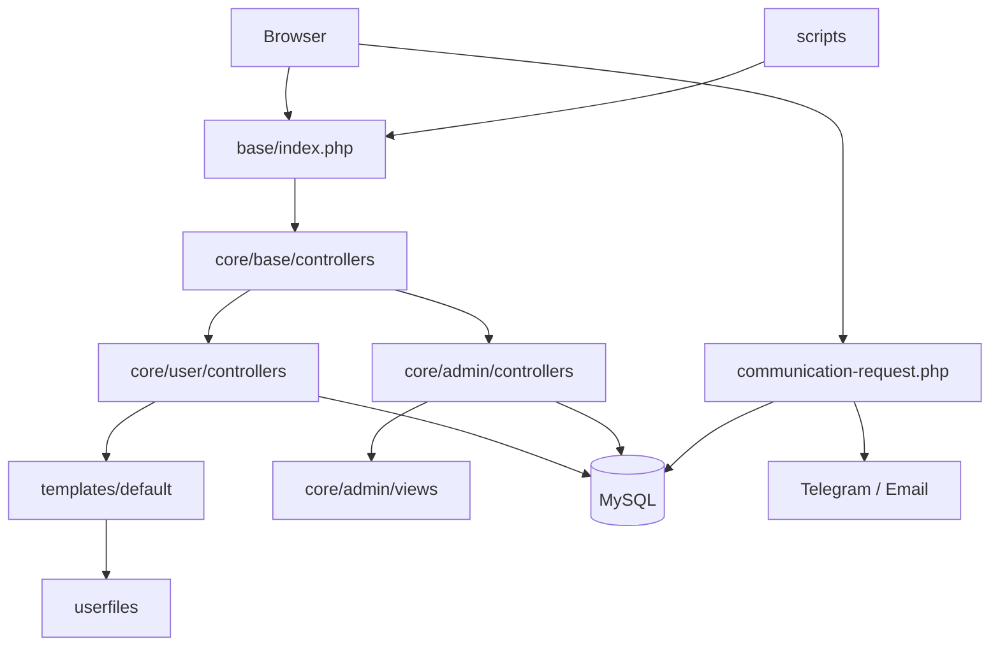

# Архітектура ForPrint Website v0.1

**ID:** `FP-WEB-ARCH-001`
**Дата:** 2026-07-16
**Статус:** active baseline

## 1. Загальна модель

ForPrint Website — legacy PHP-застосунок, який поступово приводиться до стану безпечної публікації без повного rewrite. Репозиторій містить:

1. PHP-сайт із власною MVC-подібною структурою;
2. нові ізольовані компоненти;
3. локальні inspection, smoke і maintenance tools;
4. міграції та SQL dump;
5. технічну й координаційну документацію.

Фізичний webroot — `base/`.

## 2. Основні шари

### Webroot і bootstrap

- `base/index.php` — основна точка входу.
- `base/config.php` — локальна runtime-конфігурація.
- `base/config.example.php` — безпечний приклад.
- `base/composer.json`, `base/composer.lock`, `base/vendor/` — PHP dependencies.

### Base framework

`base/core/base/` містить маршрутизацію, базові контролери, моделі, exceptions і settings. Це критичний legacy-шар, який не переписується в межах launch preparation.

### Public layer

`base/core/user/` містить public controllers, models і helpers. Рендеринг виконується через `base/templates/default/`.

### Admin layer

`base/core/admin/` містить CRUD, editor, upload logic, admin views і assets. Окремі блоки вже модернізовані, але admin залишається legacy-контуром підвищеного ризику.

### Templates and assets

`base/templates/default/` містить сторінки, layout, include-файли, CSS і JavaScript. Нові компоненти переважно мають префікс `forprint-`.

### Data

- робочі дані — MySQL;
- базовий dump — `database_dumps/`;
- версійні зміни — `database_dumps/migrations/`.

### Media

`base/userfiles/` містить goods, gallery, category, editor, settings та інші images. Один універсальний pipeline не повинен сліпо застосовуватися до всіх контекстів.

### Communication flow

`base/communication-request.php` — standalone POST endpoint для Telegram/email request:

- перевіряє метод, mode, honeypot і contact fields;
- зберігає заявку в `communication_requests`;
- виконує delivery;
- оновлює `delivery_status`;
- повертає JSON.

Endpoint навмисно не залежить від legacy controller traits.

## 3. Репозиторний контур

- `Makefile` — повторювані команди;
- `scripts/inspection/` — read-only і smoke;
- `scripts/maintenance/` — контрольовані зміни;
- `coordination/` — evidence і short status;
- `docs/` — довгоживучі пояснення;
- `tmp/work/tmp.php`, `tmp/work/tmp.py` — тимчасові operator entrypoints.

## 4. Напрямок розвитку

Використовується поступова strangler-style modernization:

1. стабільний legacy продовжує працювати;
2. нові функції ізолюються;
3. глобальні legacy handlers звужуються;
4. кожен блок проходить syntax, smoke, visual і Git checks;
5. повна framework-міграція відкладається до окремого етапу після публікації.
