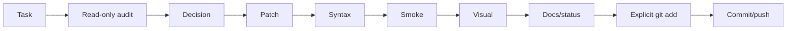

# Робочий процес власника проєкту та помічниці v0.1

**ID:** `FP-WEB-WF-001`
**Дата:** 2026-07-16
**Статус:** active

## Ролі

- Власник запускає команди на Debian, перевіряє браузер, приймає UX-рішення, робить commit/push.
- Помічниця аналізує зрізи, готує `tmp/work/tmp.php`/`tmp/work/tmp.py`, формує checks і наступний контрольований крок.

## Цикл



## Read-only перед patch

Збираються:

- `git status --short`;
- relevant diff;
- definitions/calls;
- dependency і include order;
- syntax state;
- DB context, якщо потрібний.

Read-only script не повинен тихо виправляти код.

## Один блок за раз

Phone validation не змішується з unrelated redesign або великим routing refactor. Дрібні супутні зміни допустимі, якщо без них блок неможливо завершити.

## Повна заміна tmp-файлу

Новий `tmp/work/tmp.php` або `tmp/work/tmp.py` повністю замінює старий. Перед запуском:

```bash
php -l tmp/work/tmp.php
```

або:

```bash
python -m py_compile tmp/work/tmp.py
```

## Після patch

Типовий набір:

```bash
php -l path/to/file.php
python -m py_compile path/to/file.py
FP_WEB_LOCAL_HTTP_PORT=8099 make site-smoke
make check
git diff --check
git status --short
```

`node --check` використовується, якщо Node доступний. Без Node потрібен особливо уважний browser test.

## Visual review

Перевіряються layout, responsive, text, modal, focus/error/success, старі CSS/JS collisions і фактичний Telegram/email delivery.

## Git-фіналізація

1. `git diff`;
2. explicit `git add`;
3. `git diff --cached --check`;
4. `git diff --cached --stat`;
5. meaningful commit;
6. push;
7. clean status і `git log -1 --oneline`.

## Документування

Feature block зазвичай має:

- `docs/development/<feature>_vX_Y.md`;
- `coordination/reports/forprint_website_<feature>_vX_Y.md`;
- update `coordination/status/current_status.md`.

Широкий етап отримує новий snapshot, а не rewrite старого snapshot.

<!-- FP_OPERATOR_ASSISTANT_BOOTSTRAP_CURRENT_START -->

# Current assistant bootstrap / project handoff

**Document role:** active operator-assistant bootstrap inside the existing canonical workflow document.
**Last refreshed:** `2026-08-23T12:52:06+03:00`
**Accepted release/code checkpoint at refresh:** `28ad2312bfce7fdf068326a8d2cda19e3b21f3d5`
**Project:** ForPrint Website
**Repository:** `/srv/software_development/forprint-project/forprint_website`
**Branch:** `main`

This section is intentionally a compact but deep operational slice. It is the first document a new assistant should read after `docs/README.md`. It does not duplicate all architecture, plans, or reports; it tells the assistant where the authoritative material lives, what is currently safe, what is currently dirty or frozen, and how work is actually executed.

## 1. Project model in one minute

ForPrint Website is an inherited production PHP website being stabilized and modernized without a destructive rewrite.

The wider ForPrint engineering environment uses Python for orchestration, inspections, maintenance tooling, cross-module work and assistant-generated guarded scripts. The public website runtime remains PHP for historical and operational reasons.

Core rule:

> Do not invent a parallel architecture when the project already has a canonical owner. Inspect the current implementation, identify the owner, follow accepted project documents, and prefer internationally established web/search/runtime practices.

The website is already public. Public/customer/search quality work has priority over admin modernization. Admin UI modernization is intentionally late-stage work.

## 2. Source-of-truth order

When documents disagree, use this order:

1. current code, database schema/data and runtime behavior;
2. accepted Decisions;
3. active Architecture / Workflow / Reference documents;
4. current Plans;
5. dated Status snapshots;
6. completion/release/audit reports as evidence of what happened historically.

A historical snapshot is not silently rewritten into the present. A completed report is evidence, not a new architecture owner.

Start documentation navigation here:

```text
docs/README.md
docs/architecture/
docs/workflow/
docs/reference/
docs/decisions/
docs/plans/
docs/status/
docs/documentation/
docs/development/
docs/launch_readiness/
coordination/
marketing/reports/
.runtime/reports/
```

High-value starting documents:

```text
docs/architecture/system_architecture_overview_v0_1.md
docs/architecture/legacy_and_modern_boundaries_v0_1.md
docs/workflow/operator_assistant_workflow_v0_1.md
docs/workflow/tmp_php_tmp_py_protocol_v0_1.md
docs/workflow/validation_visual_review_and_git_protocol_v0_1.md
docs/reference/repository_map_v0_1.md
docs/decisions/architecture_decision_register_v0_1.md
docs/documentation/documentation_versioning_policy_v0_1.md
docs/architecture/search_visibility_and_web_quality_strategy_v0_1.md
docs/workflow/recurring_production_quality_audits_v0_1.md
docs/plans/recurring_production_quality_audit_roadmap_v0_1.md
```

Do not duplicate these documents into this bootstrap. Follow the links and directories when deeper detail is required.

## 3. Repository and runtime map

Repository root:

```text
/srv/software_development/forprint-project/forprint_website
```

Website webroot inside the repository:

```text
base/
```

Production webroot:

```text
/var/www/825163-nikolay.k/data/www/forprint.net.ua
```

Production origin:

```text
https://forprint.net.ua
```

Production SSH:

```text
825163-nikolay.k@185.86.76.182
key: /root/.ssh/id_ed25519
```

Important runtime boundary:

- development/orchestration scripts run locally on the project host with Python;
- production must **not** be assumed to have Python;
- production probes/mutations must use bounded shell and/or PHP;
- generated PHP is syntax-checked with `php -l`.

Local preview:

```text
systemd unit: forprint-website-preview.service
bind: 127.0.0.1:8098
PHP: /usr/bin/php8.2
document root: base/
```

Useful checks:

```bash
systemctl is-active forprint-website-preview.service
systemctl --no-pager --full status forprint-website-preview.service
ss -ltnp | grep ':8098'
curl -sS -o /dev/null -w 'HTTP %{http_code}\n' http://127.0.0.1:8098/
make preview-smoke
```

## 4. Repository areas and ownership

Read `docs/reference/repository_map_v0_1.md` before broad changes.

Practical map:

```text
base/core/base/              shared framework/runtime owners
base/core/user/              public route controllers/models
base/core/admin/             legacy admin
base/templates/default/      public templates
base/templates/default/assets/css/  project-owned and inherited CSS
base/templates/default/assets/js/   public JS
base/templates/default/surfaces/    bounded surface components
base/libraries/              reusable website libraries
base/userfiles/              managed runtime media; high-risk
database_dumps/migrations/   versioned DB migrations
scripts/inspection/          read-only or smoke tooling
scripts/maintenance/         explicit controlled mutation tooling
docs/                        architecture/workflow/status/plans/reference
marketing/reports/           search/marketing audit evidence
.runtime/backups/            local/off-host operational backups
.runtime/reports/            operational release reports
```

High-risk areas include `config.php`, credentials, `vendor/`, `userfiles/`, SQL dumps, production database writes and admin upload endpoints. Do not touch them opportunistically.

## 5. Make-first discovery

Before inventing a command, inspect the Makefile:

```bash
make help 2>/dev/null || true
sed -n '1,260p' Makefile
```

Targets discovered at this refresh:

```text
help
check
makefile-check
php-syntax
inspect-security
communication-check
preview-url
preview-status
preview-start
preview-stop
preview-restart
preview-smoke
db-status
deploy-init
deploy-check
deploy-dry-run
deploy
deploy-latest-report
hosting-parity-check
hosting-reset-from-local
hosting-deploy-help
hosting-deploy-full
hosting-deploy-code
hosting-deploy-code-dry-run
hosting-deploy-frontend
hosting-deploy-frontend-dry-run
hosting-deploy-backend
hosting-deploy-backend-dry-run
hosting-deploy-dependencies
hosting-deploy-dependencies-dry-run
hosting-deploy-database
hosting-deploy-database-dry-run
hosting-deploy-media
hosting-deploy-media-dry-run
hosting-deploy-manifest
hosting-deploy-manifest-dry-run
hosting-communication-check
hosting-deploy-full-destructive
hosting-deploy-full-destructive-dry-run
hosting-deploy-database-destructive
hosting-deploy-database-destructive-dry-run
hosting-diagnostic-hygiene
hosting-diagnostic-hygiene-clean
hosting-storage-check
hosting-storage-prepare
hosting-clean-release-storage
hosting-backup-local-dry-run
hosting-backup-local
hosting-sync-full-dry-run
hosting-sync-full
hosting-restore-local-backup-dry-run
hosting-restore-local-backup
hosting-sync-contract-check
```

A new assistant must not assume every old conversational command still exists. Prefer current Make targets and current persistent scripts.

Useful persistent script candidates discovered at this refresh:

```text
scripts/inspection/audit_search_visibility.py
scripts/inspection/audit_website_repository_root_hygiene.py
scripts/inspection/check_catalog_pagination_canonical_contract.py
scripts/inspection/check_hosting_full_sync_contract.py
scripts/inspection/check_hosting_mirror_parity.py
scripts/inspection/check_hosting_storage_capacity.py
scripts/inspection/check_public_static_asset_permissions.py
scripts/inspection/check_search_visibility_release_docs.py
scripts/inspection/check_sitemap_visible_product_seed_contract.py
scripts/inspection/check_website_admin_goods_create_identity.php
scripts/inspection/check_website_catalog_sorting.php
scripts/inspection/check_website_communication_acceptance.py
scripts/inspection/check_website_communication_runtime.py
scripts/inspection/check_website_database_import_readiness.py
scripts/inspection/check_website_desktop_stabilization.py
scripts/inspection/check_website_documentation_currentness.py
scripts/inspection/check_website_first_release_checkpoint.php
scripts/inspection/check_website_foundation_refactor_v0_2.py
scripts/inspection/check_website_foundation_refinement_phase1_1.py
scripts/inspection/check_website_frontend_architecture_docs.php
scripts/inspection/check_website_frontend_governance_docs.php
scripts/inspection/check_website_frontend_profile_resolver.php
scripts/inspection/check_website_grid_cards_search_suggestions.php
scripts/inspection/check_website_head_social_contract.py
scripts/inspection/check_website_home_component_extraction.php
scripts/inspection/check_website_home_functional_contract.php
scripts/inspection/check_website_home_surface_boundary.php
scripts/inspection/check_website_image_dimensions_contract.py
scripts/inspection/check_website_international_phone_validation.php
scripts/inspection/check_website_local_runtime_smoke.py
scripts/inspection/check_website_localbusiness_schedule_contract.py
scripts/inspection/check_website_mail_operations_docs.py
scripts/inspection/check_website_notification_release_docs.py
scripts/inspection/check_website_product_card_price.php
scripts/inspection/check_website_product_card_rhythm_search_submit.php
scripts/inspection/check_website_product_defaults_cards_search.php
scripts/inspection/check_website_product_detail_feature_wrapping.php
scripts/inspection/check_website_product_image_runtime.php
scripts/inspection/check_website_product_media_architecture_docs.php
scripts/inspection/check_website_product_position_order.php
scripts/inspection/check_website_production_release_docs.py
scripts/inspection/check_website_python_environment.py
scripts/inspection/check_website_repository_root_layout.py
scripts/inspection/check_website_route_metadata_contract.py
scripts/inspection/check_website_search_precision_card_titles.php
scripts/inspection/check_website_search_ux_matching.php
scripts/inspection/check_website_seo_crawl_contract.py
scripts/inspection/check_website_staging_runtime.py
scripts/inspection/check_website_structured_data_contract.py
scripts/inspection/check_website_visual_foundation.py
scripts/inspection/local_http_smoke_router.php
scripts/inspection/run_website_local_http_smoke.py
scripts/maintenance/apply_optimized_goods_image.php
scripts/maintenance/backup_hosting_to_local.py
scripts/maintenance/cleanup_hosting_diagnostic_artifacts.py
scripts/maintenance/deploy_website_to_hosting.py
scripts/maintenance/hosting_mirror_common.py
scripts/maintenance/optimize_one_uploaded_image.php
scripts/maintenance/rebuild_image_dimensions_manifest.py
scripts/maintenance/rebuild_sitemap_from_search_audit.py
scripts/maintenance/reset_hosting_from_local.py
scripts/maintenance/restore_hosting_from_local_backup.py
scripts/maintenance/sync_hosting_database_from_local.py
scripts/maintenance/sync_local_to_hosting_full.py
```

To discover more:

```bash
find scripts/inspection -maxdepth 1 -type f | sort
find scripts/maintenance -maxdepth 1 -type f | sort
```

Inspection scripts should remain read-only. Maintenance scripts may mutate state only when their contract explicitly says so.

## 6. How operator + assistant work together

The practical scratch workflow is intentional:

1. assistant prepares a self-contained guarded Python script;
2. operator downloads it and saves it as repository-root `tmp.py`;
3. operator runs:
   ```bash
   python tmp.py
   ```
4. operator pastes the complete output back to the assistant;
5. the next action is based on the observed state, not on assumptions.

`tmp.py` and `tmp.php` are scratch entrypoints, not architecture owners.

A good mutation script normally:

- gates the exact branch/checkpoint/upstream state;
- records pre-existing dirty files;
- checks exact production hashes when relevant;
- creates a backup before mutation;
- changes only the intended files/data;
- runs syntax/focused checks;
- uses exact Git staging;
- commits/pushes only accepted scope when that step is authorized;
- verifies production after release;
- has a bounded rollback or stops before mutation when preconditions differ.

If a script stops **before** mutation, inspect the failed assumption and create a corrected script.

If mutation may already have started:

> Do not rerun blindly. Preserve the complete output and inspect the exact current state first.

## 7. Git protocol

Normal starting gate:

```bash
git branch --show-current
git rev-parse --abbrev-ref --symbolic-full-name @{u}
git fetch --prune
git rev-parse HEAD
git rev-parse @{u}
git rev-list --left-right --count HEAD...@{u}
git diff --cached --name-only
git status --short
```

Expected branch/upstream:

```text
main
origin/main
```

Use exact staging:

```bash
git add -- path/to/file1 path/to/file2
git diff --cached --name-only
git diff --cached --check
git diff --cached
git commit -m "..."
git push
```

Do not use broad `git add -A` in a dirty working tree.

Do not silently discard, stage, reset or rewrite unrelated dirty work.

## 8. Current protected / intentional working state

Batch B is no longer a dirty-work boundary. Its accepted source files are committed, pushed and released.

Current accepted source state:

```text
base/templates/default/include/header.php
base/templates/default/include/productCommunicationButtons.php
```

Both files are expected clean in Git after checkpoint:

```text
80cb51a6e575bb84e6c8749db13a8983be1fab42
```

The one intentionally untracked project file that must still not be staged, deleted or treated as canonical without a separate provenance decision is:

```text
marketing/programs/forprint_growth_roadmap_v0_1.md
```

A deliberate local/production DB difference remains outside public rendering:

```text
information.id=8 keywords
local:      контакти, друк, ForPrint
production: контакти, друк, PrintMaster
```

The public frontend does not render a meta-keywords tag for contacts. This field was intentionally excluded from Batch B production mutation. Do not repair this difference automatically.

There is no remaining goods/news Batch B DB delta.

## 9. Production release protocol

Production releases are **exact-file releases**, not full repository synchronization.

Never assume local webroot and production are byte-identical.

Typical safe release sequence:

1. confirm accepted Git checkpoint;
2. inspect dirty work and protect unrelated files;
3. hash production target files;
4. create fresh off-host backup under:
   ```text
   .runtime/backups/hosting/YYYYMMDD_HHMMSS/
   ```
5. materialize the exact release artifact;
6. upload to a unique remote `/tmp/...` path;
7. verify candidate hash;
8. run `php -l` for PHP;
9. preserve ownership/mode from the production target;
10. atomically replace the exact target;
11. verify final production hash;
12. run HTTP/functional acceptance;
13. verify protected unrelated production hashes;
14. write a release report under `.runtime/reports/`;
15. rollback only from the fresh backup and only when current-state hashes prove rollback is safe.

Do not perform a full hosting sync while unrelated local work is dirty.

A previous failure mode worth remembering:

> A committed local parent file is not necessarily the same as the current production baseline. If production intentionally differs, build a bounded artifact from the actual protected production baseline plus the exact accepted hunk instead of overwriting production with an unrelated committed baseline.

## 10. Database and migrations

Do not mutate production DB merely because source code expects a field.

Preferred flow:

```text
inspect schema/data
→ define canonical owner
→ create versioned migration when required
→ test locally
→ production preflight
→ backup / reversible plan
→ bounded PHP or database operation
→ post-check
```

Production cannot be assumed to have Python, so remote DB probes are commonly small bounded PHP programs driven by local Python orchestration.

Never print secrets into reports, docs or Git.

## 11. Search / SEO operating model

The canonical strategy is:

```text
docs/architecture/search_visibility_and_web_quality_strategy_v0_1.md
```

Principles:

- index only canonical useful public pages;
- important pages must be reachable through crawlable links;
- sitemap is generated from canonical indexable routes, not accidental URL noise;
- sorting/filtering/tracking variants do not become independent indexed pages by default;
- valid pagination remains crawlable;
- structured data must describe visible factual content;
- do not optimize scores at the expense of correctness or maintainability.

Current accepted production search baseline after the 2026-08-22 work:

```text
live sitemap URLs: 194
visible products: 164
visible product URLs in sitemap: 164/164
sitemap HTTP issues: 0
sitemap canonical issues: 0
canonical collision groups: 0
exact visible-text duplicate groups: 0
thin candidates under 350 visible-text chars: 0
representative indexable internal URLs outside sitemap: 0
valid pagination URLs outside sitemap: 9
query variants deduplicated to clean URLs: 16
variant probe failures: 0
legacy redirect probe failures: 0
```

Valid category pagination policy:

```text
clean valid page>1       -> self-canonical
page=1                   -> clean category canonical
out-of-range page        -> clean category canonical
sort/filter/quantity URL -> clean category canonical
```

Tracking examples (`utm_*`, `gclid`, `gbraid`, `wbraid`) are expected to canonicalize to the clean page.

The current sitemap URL remains the same. Normal product additions should be handled by the canonical generator rather than by manually submitting a new sitemap URL each time.

## 12. Major work already completed

Do not reopen these blocks casually; inspect their reports first.

Completed/accepted public-production work includes:

- first major Lighthouse/public performance stabilization;
- explicit image dimensions and related visual-stability work;
- canonical product price modes (`exact`, `range`, `request`);
- production search image renditions for product media;
- favicon/site identity ownership cleanup;
- WebSite / Organization / LocalBusiness identity cleanup;
- canonical business/legal identity source implementation;
- sitemap generator ownership/root-cause audit;
- permanent sitemap visible-product seed;
- production sitemap coverage repair to `164/164`;
- internal-linking and breadcrumb audit;
- catalog pagination discovery audit;
- valid pagination canonical repair;
- thin/duplicate/noncanonical baseline audit;
- Batch B public metadata/title/dialog semantics production release;
- recurring production quality audit documentation.

Use reports under:

```text
marketing/reports/
.runtime/reports/
coordination/reports/
```

before repeating an old audit or migration.

## 13. Current search-quality checkpoint

Accepted release/code checkpoint:

```text
80cb51a6e575bb84e6c8749db13a8983be1fab42
```

Latest completed production release:

```text
Batch B public metadata production release v0.2
```

Evidence:

```text
.runtime/backups/hosting/20260822_205406/batch_b_public_metadata_release_v0_2
.runtime/reports/batch_b_public_metadata_release_v0_2_20260822_205406
```

Current protected production hashes:

```text
header.php
ffd32afe254704b2af9105097e6978ef29b2ac0d4b7393b92b594d13fbfd0a7e

productCommunicationButtons.php
977f2818eeb7f48924e37a9f03b793afaf75d81819ec8400d84f15e84ffd64f9

BaseUser.php
dc977c1dab1824254df31356f66d43321416f0ad6ba08affb1977cb11e3f5ab4

CatalogController.php
da16a9d9d6b51bbc306591e82d2d0b50db58e0636120abea371b375c5e61ab28

CreatesitemapController.php
34bf3f89efe78f1cf179d2315ecd00c85feed17acc1edf9f607785439c0948c7

sitemap.xml
dc7737e23974d8fb8da876ee2d3117e93c398dc28ceb0080d1e46cd18af41eff
```

Current accepted production DB state:

```text
information.id=8 description:
Телефон, email, адреса та графік роботи ForPrint. Зв’яжіться з нами щодо друку, брендування та рекламної продукції.

information.id=8 keywords:
контакти, друк, PrintMaster
```

Batch B production acceptance:

```text
public canonical pages: 194/194
public titles: 194/194
public H1: 194/194
public og:title / og:url: 194/194
contacts metadata: PASS
communication dialogs labelled: 3/3
pagination canonical regression: PASS
sitemap owner protected: PASS
sitemap protected: PASS
rollback attempted: NO
```

The earlier thin/duplicate/noncanonical baseline remains healthy:

```text
sitemap HTTP issues: 0
sitemap canonical issues: 0
canonical collision groups: 0
exact visible-text duplicate groups: 0
thin candidates under 350 visible-text chars: 0
representative indexable internal URLs outside sitemap: 0
```

Do not reopen these green blocks without new evidence.

## 14. Batch B — CLOSED

Batch B is completed in Git and production.

Committed source / migration checkpoint:

```text
80cb51a6e575bb84e6c8749db13a8983be1fab42
```

Released source:

```text
base/templates/default/include/header.php
base/templates/default/include/productCommunicationButtons.php
```

Released public behavior:

- route/controller titles are treated as complete titles rather than receiving the old global suffix;
- already-live canonical social-head/Open Graph behavior is reconciled into Git;
- canonical pagination behavior remains preserved;
- the duplicate dynamic favicon owner remains absent;
- product communication dialogs have stable `aria-labelledby` semantics;
- contacts public description now uses the accepted ForPrint description.

Released DB mutation:

```text
information.id=8 description ONLY
```

Explicitly not mutated:

```text
goods
news
information.id=8 keywords
```

Persistent release contract:

```text
scripts/inspection/check_batch_b_release_contract.py
```

Versioned migration:

```text
database_dumps/migrations/2026_08_22_information_contacts_description_forprint_v0_1.sql
```

Do not describe Batch B as unreleased or dirty in future work. If metadata/title/dialog behavior changes again, open a new bounded work item rather than silently extending Batch B.

## 15. Google/Search Console/Ads boundary

Search Console is observation/verification, not the source of website truth.

For sitemap changes:

- keep the canonical sitemap URL stable;
- verify live HTTP content;
- let Search Console re-read the existing sitemap URL;
- use URL Inspection only when there is a concrete reason.

Google Ads/payment/business-verification work is a separate operational track. When a support case is actively resolving payment-profile or advertiser-verification identity, do not make speculative parallel changes in Ads/payment/verification that could invalidate support evidence.

Ads work must not drive unsafe website changes.

## 16. Backups and recovery

Operational backups are written under:

```text
.runtime/backups/local/
.runtime/backups/hosting/
```

A production release backup should be:

- fresh for that release;
- off-host/local to the project machine;
- exact-file where the release is exact-file;
- hash-verified;
- used for rollback only when the current target state is known.

A later project milestone is a verified external/Google Drive backup and restore checkpoint before final admin modernization.

## 17. Recurring production audits

The project has deliberately chosen read-only recurring audits rather than auto-healing.

Read:

```text
docs/workflow/recurring_production_quality_audits_v0_1.md
docs/plans/recurring_production_quality_audit_roadmap_v0_1.md
```

The intended model:

```text
real incidents/regressions
→ permanent checks
→ periodic read-only runner
→ human-reviewed report
→ explicit separate repair
```

Do not make the audit runner silently repair production.

## 18. Frontend architecture reminders

Read:

```text
docs/architecture/frontend_css_ownership_and_layout_strategy_v0_3.md
docs/architecture/home_frontend_structure_and_slider_architecture_v0_1.md
```

Key rules:

- one project-owned presentation owner per migrated component;
- no permanent stack of `v0.x` override blocks;
- new project layout/component CSS does not go into inherited `style.css`;
- use scoped `fp-` classes;
- preserve legacy fallback until a bounded migration removes it;
- responsive acceptance uses approximately 1920, 1600, 1366, 1024, 768 and 390 px;
- visual acceptance still matters even when automated checks pass.

Admin modernization remains late-stage work.

## 19. Media rules

Read:

```text
docs/architecture/media_storage_and_image_processing_policy_v0_1.md
```

Do not drop arbitrary files into `base/userfiles/`.

Product media and frontend-presentation media have different owners and storage rules. Upload/replace flows must complete file creation before DB state is changed and must preserve old media on failure unless explicit deletion was requested.

## 20. What a new assistant should do first

Before proposing a mutation:

```text
1. Read docs/README.md.
2. Read this workflow/bootstrap section.
3. Confirm Git branch/upstream/checkpoint and dirty state.
4. Inspect the relevant architecture/reference/decision documents.
5. Inspect current code/runtime instead of relying only on historical docs.
6. Read the latest report for the feature area.
7. Identify the canonical owner.
8. Prefer a read-only audit when the exact defect is not yet proven.
9. Build a bounded guarded mutation only from exact evidence.
10. Validate locally before production.
11. Use exact-file guarded release with backup.
12. Record accepted evidence and move on.
```

When continuing from a context-window reset, start by reporting:

```text
- current HEAD / origin state;
- intentional dirty files;
- latest accepted production release report;
- current roadmap item;
- exact next action;
- mutation classes that are currently forbidden/frozen.
```

## 21. Current next-step guidance

The public/search protection sequence is now materially complete through the verified external Google Drive backup checkpoint.

Current accepted code/operations checkpoint:

```text
28ad2312bfce7fdf068326a8d2cda19e3b21f3d5
```

Current next operational action:

```text
MONITOR_FIRST_SCHEDULED_GOOGLE_DRIVE_BACKUP_RUN
```

The first timer-triggered run is currently scheduled for:

```text
Sun 2026-08-30 03:41:30 EEST
```

After that run, verify from journal + Google Drive evidence that it created a new `VERIFIED` generation without requiring a clean Git worktree. The first pinned baseline `20260823T090153Z_8aced26df4b0` must remain intact.

Do not manufacture new SEO/canonical/sitemap work without new evidence. Google Ads/payment/verification mutations remain separate from this backup checkpoint. Admin UI modernization remains after the public/protection work. Recurring production audits remain read-only and human-reviewed.

## 22. Updating this bootstrap

This is an active workflow section, not a historical snapshot.

Update it when one of these changes materially:

- accepted Git checkpoint strategy;
- production deployment method;
- runtime paths or services;
- protected dirty-work boundaries;
- current roadmap phase;
- major completed production milestone;
- critical safety rule;
- canonical documentation entrypoints.

Do not append conversational history indefinitely. Replace the managed section with the current operational truth and link to detailed reports/docs for history.

<!-- FP_GOOGLE_DRIVE_BACKUP_AUTOMATION_CHECKPOINT_START -->
## Verified external backup automation checkpoint

The external disaster-recovery protection checkpoint is complete.

First verified/pinned generation:

```text
run_id:
20260823T090153Z_8aced26df4b0

remote:
forprint_backup_crypt:forprint/website_archives/20260823T090153Z_8aced26df4b0

markers:
VERIFIED.json
PINNED.json
```

The verified baseline passed:

```text
production webroot: 3522 files
userfiles: 2505 files
fresh production DB dump: 30 InnoDB tables
dirty development state: captured
working-state consistency: STABLE_DURING_SNAPSHOT
end-to-end download SHA256: PASS
isolated webroot extraction: PASS
database dump readability: PASS
Git bundle clone: PASS
encrypted recovery material: PASS
```

Permanent repository owners:

```text
scripts/maintenance/backup_forprint_to_google_drive.py
ops/systemd/forprint-google-drive-backup.service
ops/systemd/forprint-google-drive-backup.timer
```

Installed timer state at closure:

```text
enabled: yes
active: yes
Persistent: yes
RandomizedDelaySec: 20m
next elapse: Sun 2026-08-30 03:41:30 EEST
```

Operational policy:

```text
weekly full backup: yes
clean Git tree required: no
upstream synchronization required: no
dirty/staged/untracked development state: captured and labelled WIP
scheduled generations pinned by default: no
target verified generations: 8
minimum verified generations: 6
provider reserve: 20%
Cloud Backup Manager: not used for this interim workflow
```

The first pinned generation must remain protected while the scheduled system accumulates normal verified generations.

Do not reopen the backup architecture merely because the Git worktree is dirty. Dirty development state is an expected backup input.
<!-- FP_GOOGLE_DRIVE_BACKUP_AUTOMATION_CHECKPOINT_END -->

<!-- FP_OPERATOR_ASSISTANT_BOOTSTRAP_CURRENT_END -->
