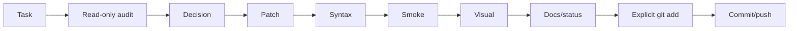

# Робочий процес власника проєкту та помічниці v0.1

**ID:** `FP-WEB-WF-001`
**Дата:** 2026-07-16
**Статус:** active

## Ролі

- Власник запускає `python tmp.py` для substantial operator artifacts, перевіряє браузер, приймає UX-рішення та окремо авторизує commit/push/deploy.
- Помічниця аналізує зрізи, готує унікальний downloadable Python artifact для повної заміни repository-root `tmp.py`, формує checks і наступний контрольований крок.

## Цикл



## Read-only перед patch

Збираються:

- `git status --short`;
- relevant diff;
- definitions/calls;
- dependency і include order;
- syntax state;
- DB context, якщо потрібний.

Read-only script не повинен тихо виправляти код.

## Один блок за раз

Phone validation не змішується з unrelated redesign або великим routing refactor. Дрібні супутні зміни допустимі, якщо без них блок неможливо завершити.

## Repository-root tmp.py / one-command contract

Primary execution contract:

```text
download unique Python artifact
→ replace repository-root tmp.py completely
→ python tmp.py
```

The assistant syntax-checks the downloadable artifact before handoff. The
operator does not need a routine manual `py_compile` command.

Canonical details:
`docs/assistant_workflow/SINGLE_COMMAND_OPERATOR_PROTOCOL.md`.

The older `tmp/work/tmp.php` / `tmp/work/tmp.py` paths are historical and are
not the current operator entrypoint.

## Після patch

Типовий набір:

```bash
php -l path/to/file.php
python -m py_compile path/to/file.py
FP_WEB_LOCAL_HTTP_PORT=8099 make site-smoke
make check
git diff --check
git status --short
```

`node --check` використовується, якщо Node доступний. Без Node потрібен особливо уважний browser test.

## Visual review

Перевіряються layout, responsive, text, modal, focus/error/success, старі CSS/JS collisions і фактичний Telegram/email delivery.

## Git-фіналізація

1. `git diff`;
2. explicit `git add`;
3. `git diff --cached --check`;
4. `git diff --cached --stat`;
5. meaningful commit;
6. push;
7. clean status і `git log -1 --oneline`.

## Документування

Feature block зазвичай має:

- `docs/development/<feature>_vX_Y.md`;
- `coordination/reports/forprint_website_<feature>_vX_Y.md`;
- update `coordination/status/current_status.md`.

Широкий етап отримує новий snapshot, а не rewrite старого snapshot.

<!-- FP_OPERATOR_ASSISTANT_BOOTSTRAP_CURRENT_START -->

# Current assistant bootstrap / compatibility handoff

**Last refreshed:** `2026-09-05`

The primary assistant entrypoint is now repository-root `AGENTS.md`.

Read:

```text
AGENTS.md
docs/project_state/current/CURRENT_PROJECT_STATE.md
docs/assistant_workflow/SINGLE_COMMAND_OPERATOR_PROTOCOL.md
docs/workflow/operator_assistant_workflow_v0_1.md
```

This embedded bootstrap is retained only so old references to
`FP_OPERATOR_ASSISTANT_BOOTSTRAP_CURRENT` lead to the new canonical entrypoint.
It is no longer the live copy of Phase 8 state.

Current high-level status:

```text
branch: main
HEAD at integration preparation: 9dc6d12cb12c12007c42d83c760b2479819a6506
Phase 1–7 admin structural modernization: COMPLETE
Phase 8 admin visual refinement: ACTIVE
working tree: broad / intentionally dirty
production deployment: NOT PART OF THIS CHECKPOINT
```

For substantial assistant work, root `tmp.py` uses the one-command contract:

```text
python tmp.py
```

Reports use `tmp/operator_reports/<workstream>/`; raw evidence uses
`tmp/operator_runtime/<workstream>/`. Report handoff semantics are defined in
the canonical single-command protocol.

Do not restart completed structural audits. Read the live state, inspect current
Git/runtime/source evidence and continue the smallest safe active slice.

<!-- FP_OPERATOR_ASSISTANT_BOOTSTRAP_CURRENT_END -->

<!-- FP_OPERATOR_COMMUNICATION_CONVENTION_V0_1_START -->
## Communication convention

For assistant/operator communication in this project:

- communicate in friendly Ukrainian using `ти`;
- the operator is addressed as a man;
- the assistant uses feminine self-reference in Ukrainian;
- keep explanations practical and compact;
- prefer a complete bounded script for a understood work slice instead of many
  tiny sequential scripts.

This convention is presentation/workflow metadata, not a security or approval
override.
<!-- FP_OPERATOR_COMMUNICATION_CONVENTION_V0_1_END -->
