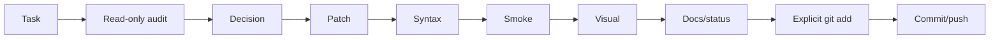

# Робочий процес власника проєкту та помічниці v0.1

**ID:** `FP-WEB-WF-001`
**Дата:** 2026-07-16
**Статус:** active

## Ролі

- Власник запускає команди на Debian, перевіряє браузер, приймає UX-рішення, робить commit/push.
- Помічниця аналізує зрізи, готує `tmp.php`/`tmp.py`, формує checks і наступний контрольований крок.

## Цикл



## Read-only перед patch

Збираються:

- `git status --short`;
- relevant diff;
- definitions/calls;
- dependency і include order;
- syntax state;
- DB context, якщо потрібний.

Read-only script не повинен тихо виправляти код.

## Один блок за раз

Phone validation не змішується з unrelated redesign або великим routing refactor. Дрібні супутні зміни допустимі, якщо без них блок неможливо завершити.

## Повна заміна tmp-файлу

Новий `tmp.php` або `tmp.py` повністю замінює старий. Перед запуском:

```bash
php -l tmp.php
```

або:

```bash
python -m py_compile tmp.py
```

## Після patch

Типовий набір:

```bash
php -l path/to/file.php
python -m py_compile path/to/file.py
FP_WEB_LOCAL_HTTP_PORT=8099 make site-smoke
make check
git diff --check
git status --short
```

`node --check` використовується, якщо Node доступний. Без Node потрібен особливо уважний browser test.

## Visual review

Перевіряються layout, responsive, text, modal, focus/error/success, старі CSS/JS collisions і фактичний Telegram/email delivery.

## Git-фіналізація

1. `git diff`;
2. explicit `git add`;
3. `git diff --cached --check`;
4. `git diff --cached --stat`;
5. meaningful commit;
6. push;
7. clean status і `git log -1 --oneline`.

## Документування

Feature block зазвичай має:

- `docs/development/<feature>_vX_Y.md`;
- `coordination/reports/forprint_website_<feature>_vX_Y.md`;
- update `coordination/status/current_status.md`.

Широкий етап отримує новий snapshot, а не rewrite старого snapshot.
