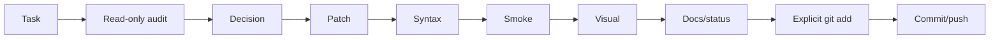

# Робочий процес власника проєкту та помічниці v0.1

**ID:** `FP-WEB-WF-001`
**Дата:** 2026-07-16
**Статус:** active

## Ролі

- Власник запускає команди на Debian, перевіряє браузер, приймає UX-рішення, робить commit/push.
- Помічниця аналізує зрізи, готує `tmp/work/tmp.php`/`tmp/work/tmp.py`, формує checks і наступний контрольований крок.

## Цикл



## Read-only перед patch

Збираються:

- `git status --short`;
- relevant diff;
- definitions/calls;
- dependency і include order;
- syntax state;
- DB context, якщо потрібний.

Read-only script не повинен тихо виправляти код.

## Один блок за раз

Phone validation не змішується з unrelated redesign або великим routing refactor. Дрібні супутні зміни допустимі, якщо без них блок неможливо завершити.

## Повна заміна tmp-файлу

Новий `tmp/work/tmp.php` або `tmp/work/tmp.py` повністю замінює старий. Перед запуском:

```bash
php -l tmp/work/tmp.php
```

або:

```bash
python -m py_compile tmp/work/tmp.py
```

## Після patch

Типовий набір:

```bash
php -l path/to/file.php
python -m py_compile path/to/file.py
FP_WEB_LOCAL_HTTP_PORT=8099 make site-smoke
make check
git diff --check
git status --short
```

`node --check` використовується, якщо Node доступний. Без Node потрібен особливо уважний browser test.

## Visual review

Перевіряються layout, responsive, text, modal, focus/error/success, старі CSS/JS collisions і фактичний Telegram/email delivery.

## Git-фіналізація

1. `git diff`;
2. explicit `git add`;
3. `git diff --cached --check`;
4. `git diff --cached --stat`;
5. meaningful commit;
6. push;
7. clean status і `git log -1 --oneline`.

## Документування

Feature block зазвичай має:

- `docs/development/<feature>_vX_Y.md`;
- `coordination/reports/forprint_website_<feature>_vX_Y.md`;
- update `coordination/status/current_status.md`.

Широкий етап отримує новий snapshot, а не rewrite старого snapshot.

<!-- FP_OPERATOR_ASSISTANT_BOOTSTRAP_CURRENT_START -->

# Current assistant bootstrap / project handoff

**Document role:** active operator-assistant bootstrap inside the canonical workflow.
**Last refreshed:** `2026-08-24T18:10:00+03:00`
**Project:** ForPrint Website
**Repository:** `/srv/software_development/forprint-project/forprint_website`
**Branch:** `main`
**Accepted admin structural checkpoint:** `eb5f0a314f633ab0a7f33af529e7b9f0072ae26c`
**Current admin stage:** `Phase 8 — visual refinement`

## Start here after a context reset

Read, in this order:

```text
docs/status/snapshots/2026-08-24_admin_ui_visual_refinement_entry_state_v0_1.md
docs/plans/admin_ui_modernization_plan_v0_2.md
docs/reference/admin_ui_visual_refinement_contract_v0_1.md
docs/decisions/2026-08-23__canonical_admin_css_ownership_and_migration_order.md
```

Then inspect the current code and the latest relevant report.

Immediate working evidence:

```text
tmp/admin_refactor/121_phase8_goods_visual_system_baseline_audit_20260824_1756.md
tmp/admin_refactor/122_phase8_goods_visual_contract_exact_owner_resolver_20260824_1802.md
```

## Project model

The website is inherited PHP. The wider engineering/tooling workflow uses
Python for inspections, orchestration and guarded assistant-generated scripts.

Do not invent a parallel architecture. Resolve the canonical owner first and
prefer internationally established web/runtime/accessibility practices.

## Current state

```text
Phase 1–7 structural admin modernization: COMPLETE
Phase 7 commit: eb5f0a314f633ab0a7f33af529e7b9f0072ae26c
origin/main verification: PASS
production deployment: NOT PART OF THIS CHECKPOINT
Phase 8 visual refinement: ACTIVE
```

The first Phase 8 patch has not yet been applied.

## Exact next action

Build the first bounded Goods visual patch from resolver 122:

```text
shared tokens
shared action buttons
shared field/card surfaces
shared label/hint typography
shared spacing rhythm
neutral Goods count badge
compact shared image actions
```

Then validate locally and request a fresh Goods screenshot before moving
downward.

## Visual direction

Use one coherent admin language:

- light rounded blocks;
- subtle borders/shadows;
- consistent spacing;
- readable typography;
- visually related Save/Delete controls;
- neutral informational counts;
- efficient image actions;
- two-column default composition;
- shared tokens for values that should change across the whole admin.

Media Processing is a loose block-layout reference, not a separate canonical
style system.

## Communication style

Communicate with the project owner in simple, friendly Ukrainian without
bureaucratic formality.

The assistant refers to her own actions in the feminine grammatical form:

```text
я перевірила
я підготувала
я бачу
я пропоную
```

When the owner pastes a report or screenshot, analyze it directly. Ask a
clarifying question only when the evidence is insufficient for a safe decision.

## Working protocol

For nontrivial work:

```text
read-only evidence
→ decision
→ unique timestamped Python script
→ user runs it from repo root
→ report in tmp/admin_refactor/
→ assistant reviews report
→ local smoke/screenshot
→ acceptance
→ exact staging
→ commit
→ push if explicitly intended
```

Never reuse generated filenames.

Never broad-stage unrelated dirty work.

## Canonical admin owners

```text
main.css                        legacy fallback only
forprint-admin.css              shared admin tokens/primitives
forprint-admin-goods-form.css   Goods-specific presentation
forprint-admin-gallery.css      gallery presentation
forprint-admin-ordering.css     ordering/save-status
forprint-admin-ui.css           bounded specialized owner
```

No new generic admin presentation goes into `main.css`.

## Preserve

Do not casually change:

- routing/auth/backend contracts;
- generic CRUD field names;
- AJAX payloads;
- TinyMCE contract;
- gallery upload/FileList compatibility;
- database;
- production.

Visual refinement is presentation-first.

## New-assistant first response

After reading the handoff, report compactly:

```text
HEAD
current Phase 8 item
latest evidence read
canonical owner(s)
exact next visual slice
whether relevant files are clean vs HEAD
```

If those match the handoff, continue directly. Do not restart completed
structural audits.

<!-- FP_OPERATOR_ASSISTANT_BOOTSTRAP_CURRENT_END -->
